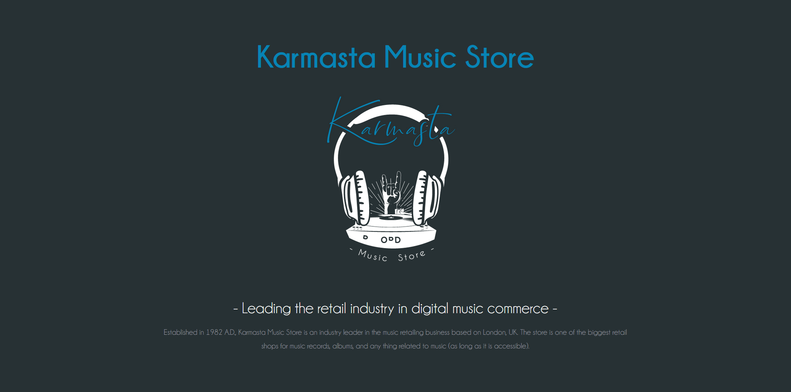
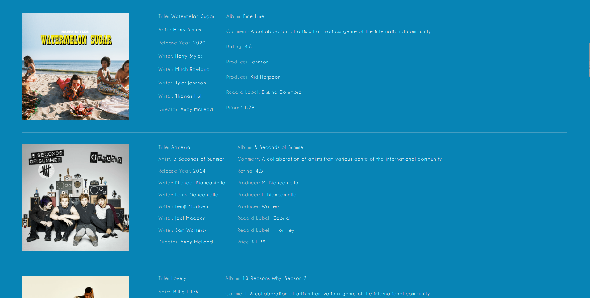

# Karmasta Music Store

  
This coursework was assigned to us in second year, and we were to design a system for a music store using XML development. This website is simply a prototype for a hypothetical company looking to build a website.
 

  
  

  

  

  

  

  

  
  
  
  
  

## Objective

Some objectives for the coursework are given below:
• Be familiar with the inner workings of XML as well as its schema and DTD.
• Create external CSS capable of rendering XML in a one-page website format.
• Test and Validate the XML with appropriate tool.

  

## Run UI

Open [karmastaMuisc.xml](https://github.com/karmasta13/Academics/blob/main/Karmasta%20Music%20Store/karmastaMusic.xml) in your web browser to run the UI

  

