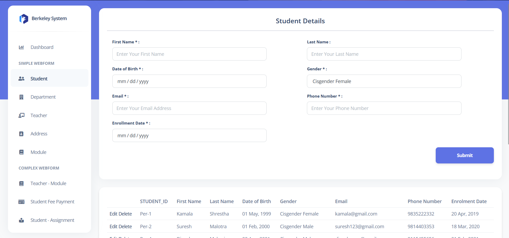
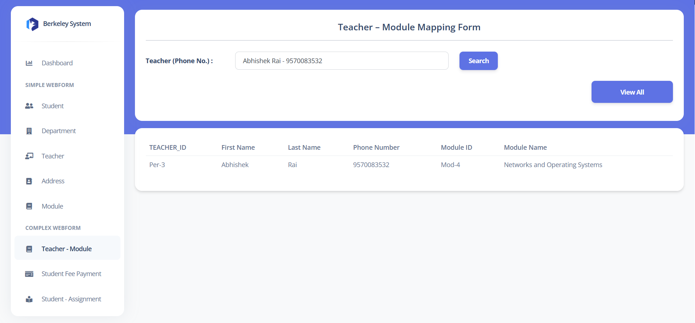

# Berkeley College System

  
In this coursewor, the database system has been developed and designed for a hypothetical college, Berkeley college. According to the case study, the college requires the development of a web-based system capable of performing basic CRUD (Create, Read, Update, Delete) functions, as well as a manual to assist users in properly using the system. To do this, the Oracle database and ASP.NET Web Core, as well as other required tools such as SQL Developer, Data Modeler, and Visual Studio IDE, were chosen and integrated into the system's development.

  
  

## Index

- [Features](#features)

- [Requirements](#requirements)

- [Application Preview](#ApplicationPreview)

  
   

## Features

Some of the features included in the system are:

- Implementation of a web-based database application which includes the following webforms (web pages) using ASP.NET with C#: Student details, Department Details, Teacher Details, Address Details, Module Details. 

- Teacher - Module Mapping Form (for any teacher, details of the teacher and the details of all modules that they teach are shown)

- Student Fee Payment Form (For any Student, the detail of the student and payment with amount and date of payment are shown)

- Student - Assignment Form ( For any student, the details of student with their module assignment result details are shown)

- Implementation of a homepage website that includes an options menu with
an Attractive Graphical Dashboard.

  
 
  

## Requirements

  

- The.NET Framework [Ideally V.4] must be installed on the system.

- Visual Studio 2019

- Run the sql commands inside the [Berkeley Sql Script](https://github.com/karmasta13/Academics/blob/main/berkeley/Berkeley%20Sql%20Script.sql)  file to create a database for the system.

  
 

## Application Preview

  

 

  
  

 

 

